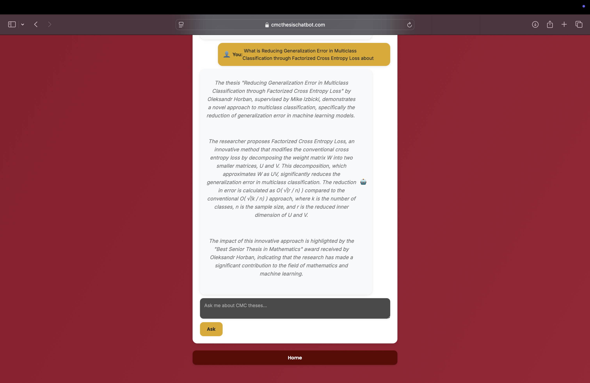
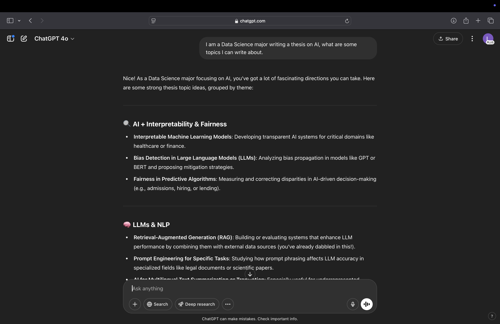
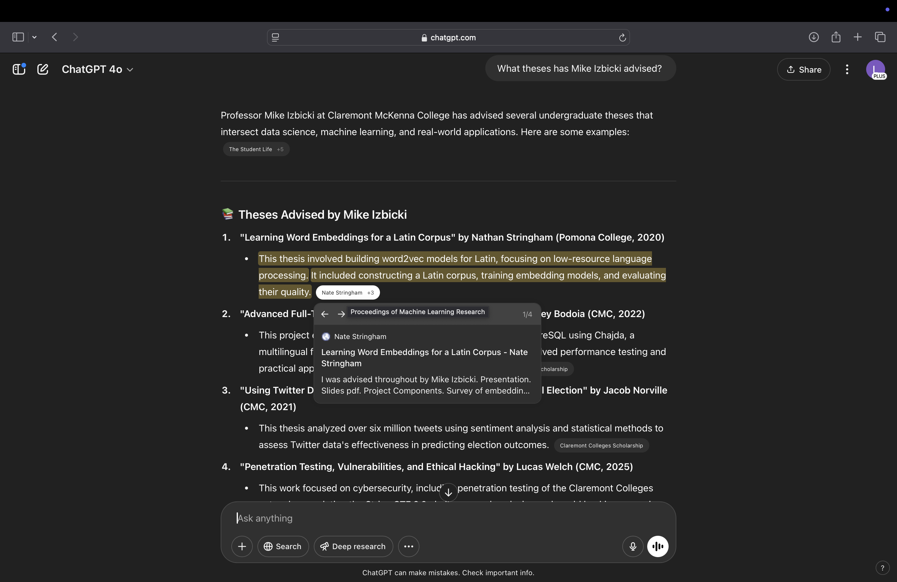
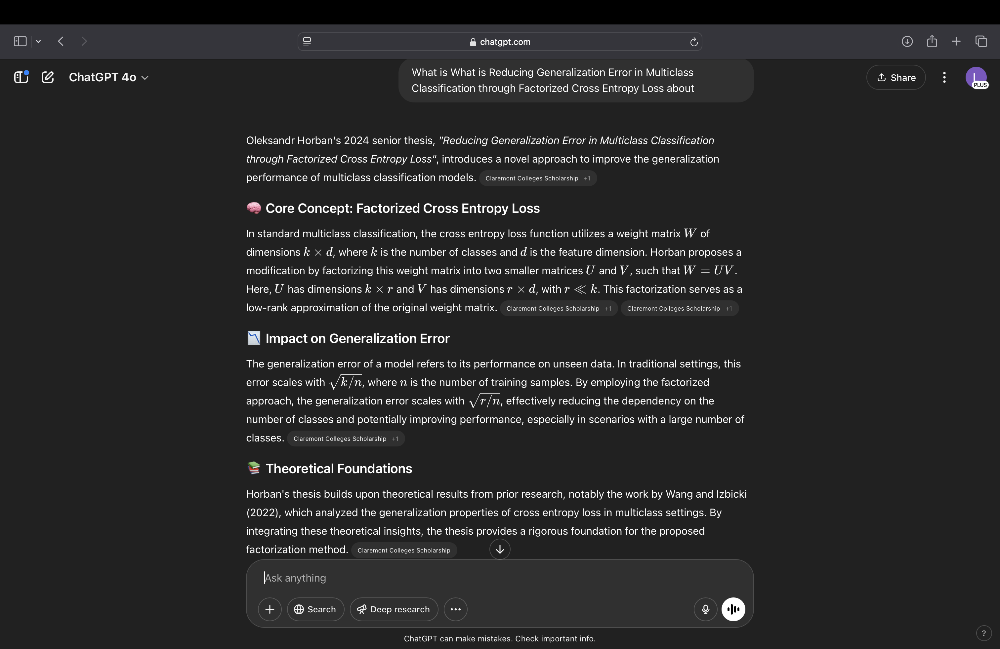

# CMC Thesis Chatbot

An interactive RAG-based chatbot that helps students, researchers, and faculty explore Claremont McKenna College senior theses.  
[cmcthesischatbot.com](https://cmcthesischatbot.com)

---

## Overview

Built as a senior thesis project, this system combines Groq's LLM with a structured SQLite database to provide intelligent, thesis-specific answers. It supports search, analysis, and brainstorming based on metadata from CMC’s thesis archive (through Fall 2024).
 

1. **Data Collection**  
   - CSVs sourced from [Scholarship@Claremont](https://scholarship.claremont.edu)  
   - Cleaned, merged, and indexed into `theses.db` with FTS5

2. **Architecture (RAG)**  
   - **Retrieve**: Matches user query to thesis data (title, author, department, etc.)  
   - **Augment**: Adds metadata to the prompt  
   - **Generate**: Groq LLM crafts accurate, natural responses  
   - **Format**: Returns structured, markdown-friendly output
(Specifically the LLM reads the prompt, makes SQL queries based on the prompt to run, and based on the outputs gives the user their answer)

3. **Deployment**  
   - Flask backend + Docker  
   - CI/CD with GitHub Actions  
   - Deployed on AWS EC2 with secure HTTPS via Route 53 + ACM

---

## Features

-  Search by title, author, advisor, department, or keyword  
-  Run analytical queries (e.g. "How many Economics theses in 2020?")  
-  Get thesis ideas with outlines and advisor suggestions  
-  Summarize or explain thesis based on abstracts  
-  Explore advisor expertise  

---

## Interface Examples

### Get Thesis Ideas / Outline
 

### Advisor Search

### Thesis Search

## Comparison With CHATGPT4o

### Get Thesis Ideas / Outline

Gives ideas not based on current thesis metadata. This could lead to repeated ideas.

### Advisor Search

Gives information over thesis/papers not in the metadata and from another source.

### Thesis Search

Both systems can summarize papers but ChatGPT cant have access to all thesis like my system.
Adding the actual paper icontent to the metadata will ensure better summarize. 

---

## Future Development Roadmap

- Enhanced query handling with fuzzy matching and spell correction
- Add more to metadata
- Responsive UI design for improved mobile experience
- User authentication for personalized session history
- Production-grade WSGI implementation (NGINX + Gunicorn)

---

## Acknowledgments

Special thanks to:
1. My family (mom, grandma, grandpa, sister) for their unwavering support
2. Professor Mike Izbicki for guidance and mentorship
3. The CMC community for fostering an environment of academic excellence and innovation
4. Claremont Colleges Library for providing access to the thesis repository data

