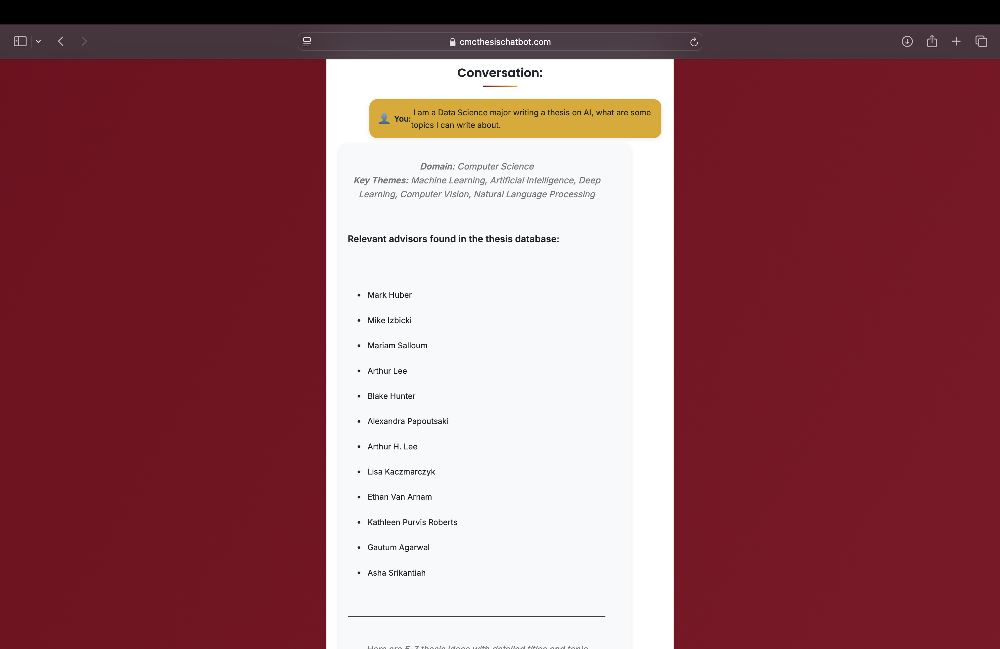
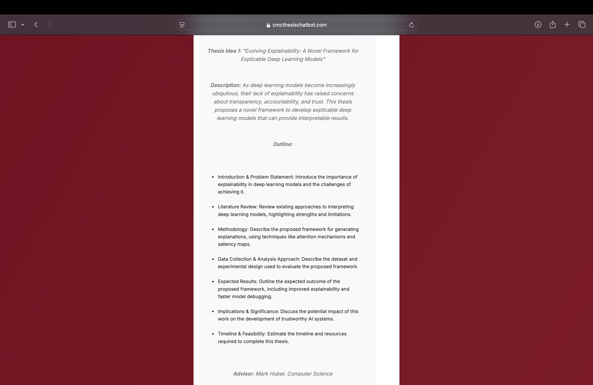
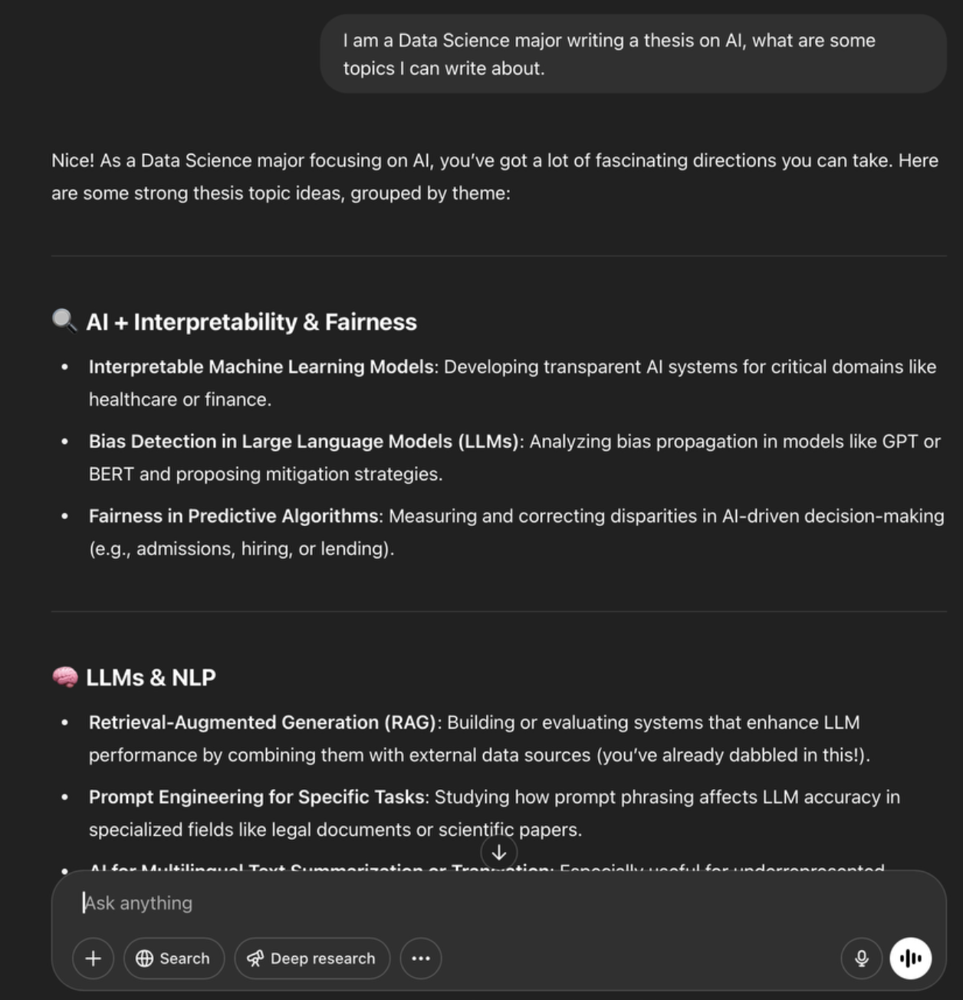
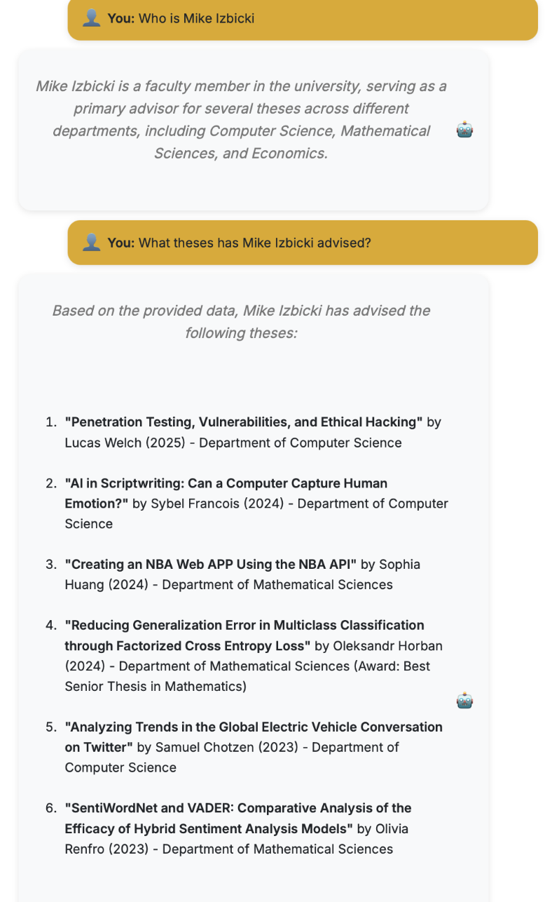
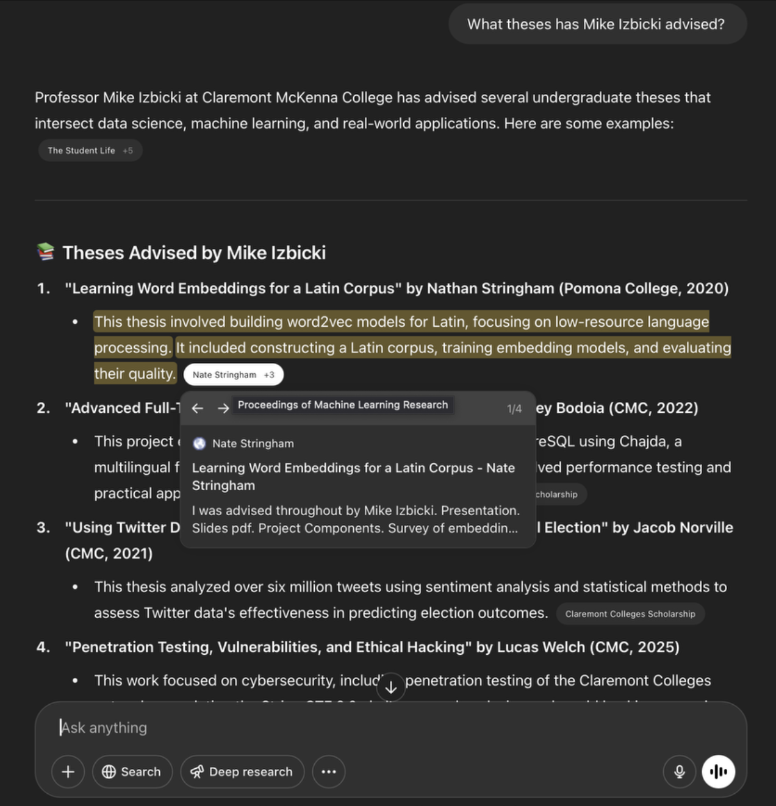
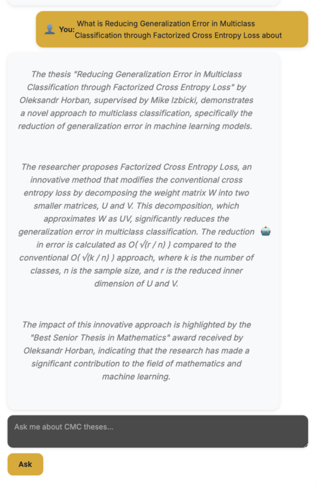
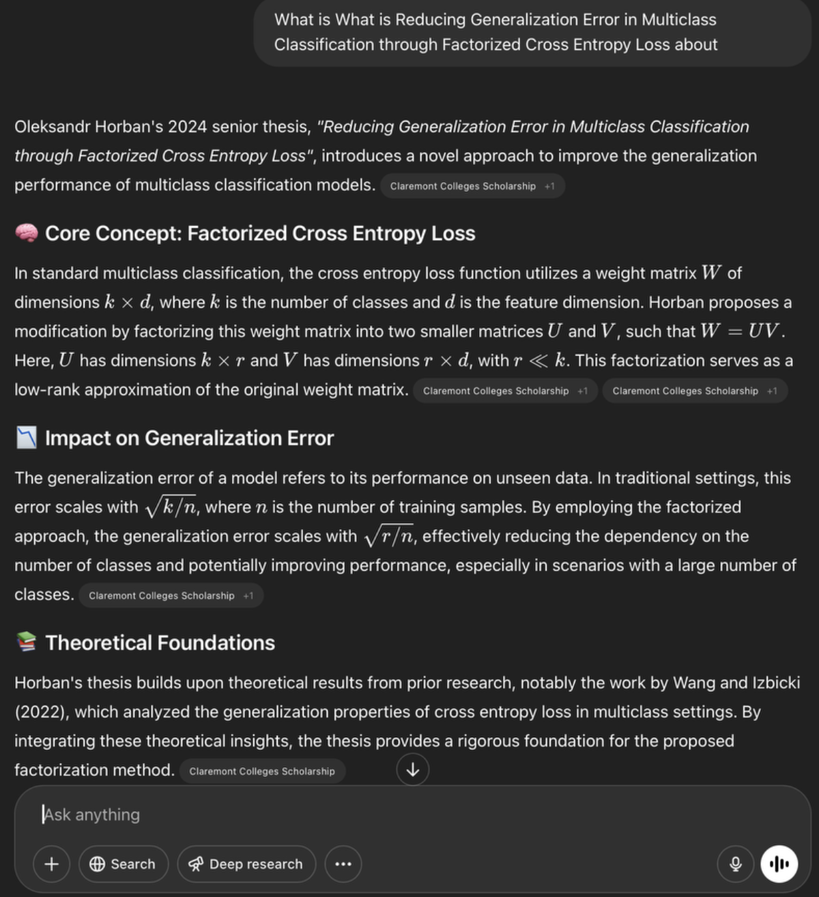

# CMC Thesis Chatbot


A Retrieval-Augmented Generation (RAG) chatbot that answers questions about Claremont McKenna College senior theses using real database records — not general model knowledge.

🌐 https://cmcthesischatbot.com

---

## What It Does

This system translates natural language questions into structured database queries and semantic searches over CMC thesis metadata.

It can:

- Search theses by title, topic, advisor, department, or year  
- Rank advisors by topic expertise  
- Filter by award, season, or publication date  
- Summarize real abstracts  
- Generate thesis ideas grounded in actual CMC data  

Unlike ChatGPT, every response is backed by records from the CMC thesis archive.

---

## Architecture

**Backend:** Flask  
**Database:** SQLite (`theses2.db`)  
**Embeddings:** SentenceTransformers (`all-MiniLM-L6-v2`)  
**Vector Store:** ChromaDB (persistent, cosine similarity)  
**LLM:** Groq `llama-3.1-8b-instant`  
**Deployment:** Docker + AWS EC2  
**CI/CD:** GitHub Actions  

---

## Query Pipeline

```
classify() → fetch() → respond()
  (LLM)        (no LLM)      (LLM)
```

### 1. Classify  
LLM extracts:
- intent (title lookup, topic search, aggregation, person lookup)
- entities (names, topics, filters)

### 2. Fetch  
Pure retrieval:
- SQL for structured queries  
- Vector search (ChromaDB) for semantic topic matching  
- Hybrid (SQL filter → vector re-rank) for constrained topic queries  

### 3. Respond  
LLM formats only the retrieved records into a grounded answer.  
It is explicitly instructed not to use outside knowledge.

---

## Hallucination Prevention

- Topic-based advisor rankings use vector search first, then count advisors within real results  
- Prompts include strict grounding instructions  
- Advisor and author lookups run separate SQL queries  

The model never invents advisors or theses.

---

## Data

Source: Scholarship@Claremont  
Stored in SQLite with fields including:

- Title  
- Author(s)  
- Advisor(s)  
- Department(s)  
- Abstract  
- Keywords  
- Award  
- Publication date  
- Season  
- URL  

---

## Interface Examples & Comparison With ChatGPT-4o

### Thesis Ideas / Outline
| CMC Thesis Chatbot | ChatGPT-4o |
|--------------------|------------|
|   |  |

---

### Advisor Search
| CMC Thesis Chatbot | ChatGPT-4o |
|--------------------|------------|
|  |  |

---

### Thesis Search
| CMC Thesis Chatbot | ChatGPT-4o |
|--------------------|------------|
|  |  |

---

## Project Structure

```
rag_system17.py      # classify → fetch → respond
config.yaml          # acronym expansion
theses2.db           # SQLite database
chroma_store/        # persistent vector index
screenshots/
Dockerfile
.github/workflows/deploy.yml
```

---

## Setup

```bash
pip install chromadb sentence-transformers groq numpy pyyaml flask

# Build vector index (run once)
python rag_system17.py --build-index

# Start chatbot
python rag_system17.py
```

Set API key:

```bash
export GROQ_API_KEY=your_key_here
```

---

## Future Improvements

- Web UI (currently CLI)
- Caching layer
- Full-text thesis embeddings
- Multi-turn conversation support

