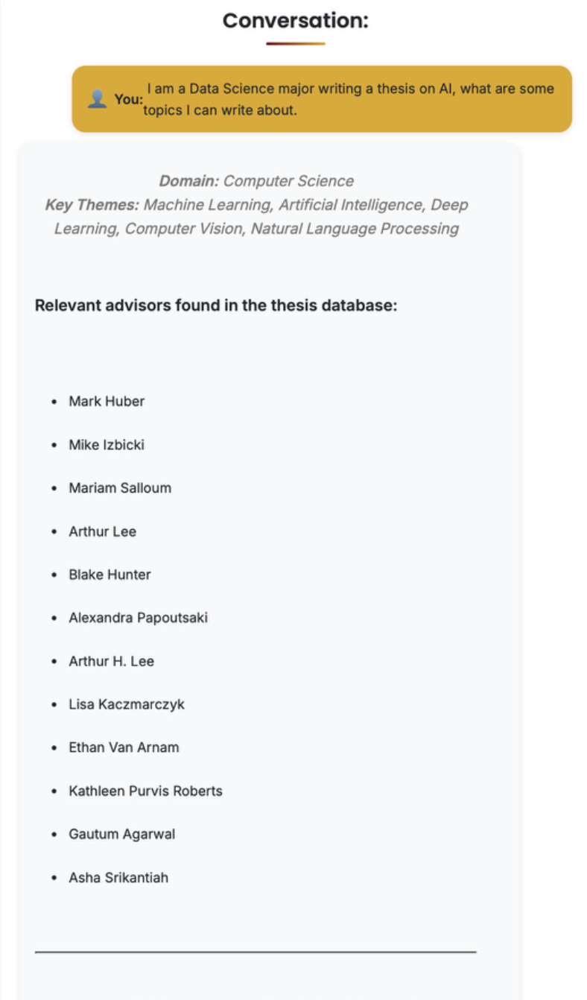

# CMC Thesis Chatbot

An interactive RAG-based chatbot that helps students, researchers, and faculty explore Claremont McKenna College senior theses. [cmcthesischatbot.com](https://cmcthesischatbot.com)

## Overview

Built as a senior thesis project, this system combines Groq's LLM with a structured SQLite database to provide intelligent, thesis-specific answers. It supports search, analysis, and brainstorming based on metadata from CMC’s thesis archive (through Fall 2024).

**Data Collection**  
- CSVs sourced from [Scholarship@Claremont](https://scholarship.claremont.edu)  
- Cleaned, merged, and indexed into `theses.db` with FTS5

**Architecture (RAG)**  
- **Retrieve**: Matches user query to thesis data (title, author, department, etc.)  
- **Augment**: Adds metadata to the prompt  
- **Generate**: Groq LLM crafts accurate, natural responses  
- **Format**: Returns structured, markdown-friendly output  
- (Specifically: The LLM reads the prompt, generates SQL queries, executes them, and formulates the final answer.)

**Deployment**  
- Flask backend + Docker  
- CI/CD with GitHub Actions  
- Deployed on AWS EC2 with secure HTTPS (Route 53 + ACM)

**Features**  
- Search by title, author, advisor, department, or keyword  
- Run analytical queries (e.g., "How many Economics theses in 2020?")  
- Get thesis ideas with outlines and advisor suggestions  
- Summarize or explain thesis abstracts  
- Explore advisor expertise

---

## Interface Examples & Comparison With ChatGPT-4o

### Thesis Ideas / Outline
| CMC Thesis Chatbot | ChatGPT-4o |
|--------------------|------------|
|   |  |
| *Generates ideas based on real thesis metadata and advisor matching.* | *Ideas not grounded in CMC thesis data, risks repetition and lacks specific advisor context.* |

---

### Advisor Search
| CMC Thesis Chatbot | ChatGPT-4o |
|--------------------|------------|
|  |  |
| *Finds actual advisors from the thesis database based on query context.* | *Returns unrelated advisor info not present in the thesis metadata.* |

---

### Thesis Search
| CMC Thesis Chatbot | ChatGPT-4o |
|--------------------|------------|
|  |  |
| *Searches and summarizes from actual theses in the CMC database.* | *Can summarize papers but lacks access to full CMC thesis archive.* |

---

## Future Development Roadmap

- Enhanced query handling with fuzzy matching and spell correction
- Expand metadata coverage
- Responsive UI design for mobile devices
- User authentication for session tracking
- Production-grade deployment (NGINX + Gunicorn)

---

## Acknowledgments

Special thanks to:  
1. My family (mom, grandma, grandpa, sister) for their unwavering support  
2. Professor Mike Izbicki for guidance and mentorship  
3. The CMC community for fostering an environment of academic excellence and innovation  
4. Claremont Colleges Library for providing access to thesis repository data

